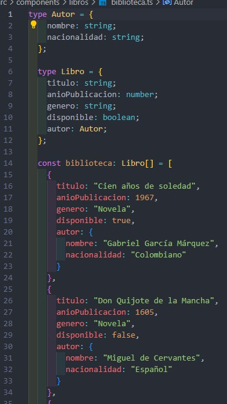
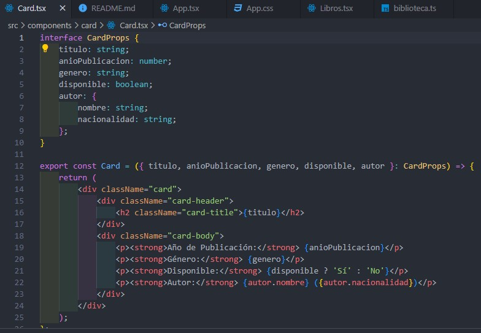
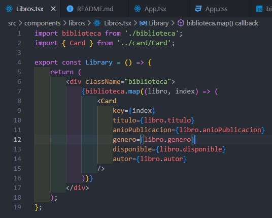
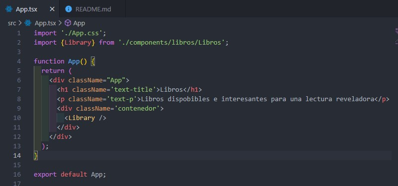
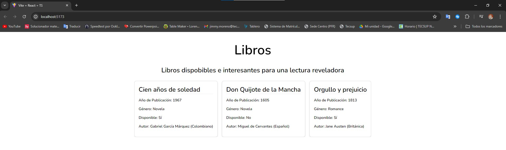

# Proyecto Biblioteca 

Aplicación web en React utilizando TypeScript para renderizar una serie de tarjetas que contienen información sobre diferentes libros. Cada tarjeta incluye detalles como el título del libro, el año de publicación, el género, la disponibilidad y el autor. 

## Pasos del Desarrollo

1. **Definición de Tipos:**
   - Se definieron los tipos de datos para el proyecto, incluyendo un tipo para Libro y otro para Autor.

2. **Creación del Array de Objetos:**
   - Se creó un array de objetos llamado biblioteca que contiene la información de los libros. Cada objeto en el array representa un libro y contiene propiedades como titulo, anioPublicacion, genero, disponible, y autor.
   

3. **Componente de Tarjeta (Card):**
   - Se desarrolló un componente Card que toma las propiedades del libro y las muestra en una tarjeta.
   - Se definió una interfaz CardProps para las propiedades del componente Card.
    

4. **Componente de Libros (Libros):**
   - Se creó un componente Libros que recorre el array biblioteca y renderiza una tarjeta por cada libro utilizando el componente Card.
    

5. **Ejecución aplicación:**
   - Se integraron todos los componentes en la aplicación principal (App.tsx) y se aseguraron de que los estilos se aplicaran correctamente.
   - Se organizó la estructura del proyecto para mantener el código limpio y modular.
    
    

